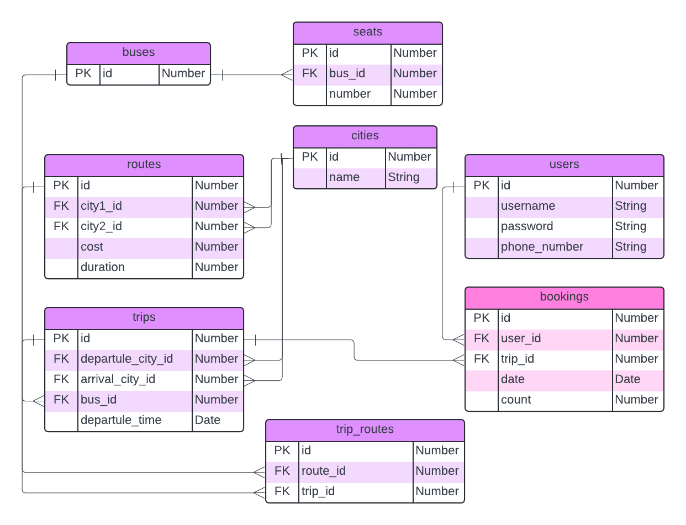
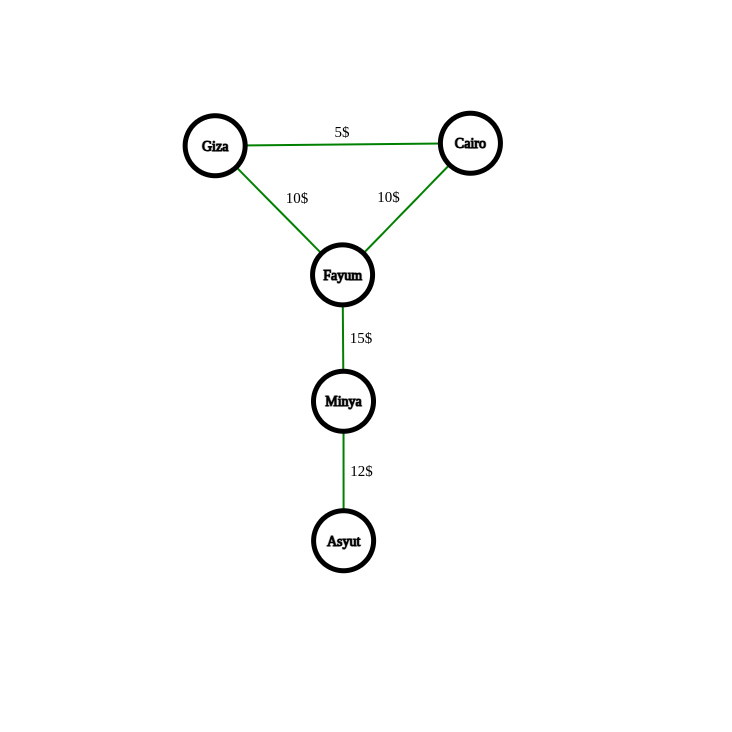

# Bus Booking System

## Overview
* The Bus Booking System is a service designed to manage bus trips, bookings, and routes. Users can book trips between cities with buses passing through multiple stations. Each bus has a fixed number of seats (12), and bookings are managed to ensure seats are available for users.

## Features
* Trip Booking: Users can book trips from one city to another. Buses pass through several cities, and users can book seats on a bus from any station to another station on the same route.
* Seat Management: Each bus has 12 seats, bookings are only allowed if seats are available, and the number of seats is dynamic
* Route Management: Trips follow predefined routes, and users can book from any station to another within the same route.


## Installation
* Clone the repository
* Run `bundle install`
* Run `rails db:migrate`
* Run `rails db:seed`
* Run `rails s`
* Enjoy!

## More Information

> Database Schema Models
 


> Routes Graph



## Build The System

> The system has a predefined set of routes and buses. Users can book trips between cities with buses passing through multiple stations. Each bus has a dynamic  number of seats (12), and bookings are managed to ensure seats are available for users.

---

## Main API Endpoints

> For Admins

### 1. Build the system

> We create cities and each city is a station we then creates our routes using cities we define here
* **URL**: `/api/v1/cites`
* **Method**: `post`
* **description**: creates a new city (station)
  
> We creates buses and each bus has it's own number of seates we define in the create route
* **URL**: `/api/v1/buses`
* **Method**: `post`
* **body**: 
```json
{
  "seats": [
    1, 2, 3, 4, 5, 6, ...., 12
  ]
}
```

> We create routes our trips and each trip has a bus, a departure city and a destination city
* **URL**: `/api/v1/trips`
* **Method**: `post`
* **description**: creates a new city (station)
* **body**: 
```json
{
  "bus_id": 1,
  "route_id": 1,
  "departure_city_id": 1,
  "destination_city_id": 2,
  "departure_time": "2021-09-26T14:00:00.000Z",
}
```

> We initalize our routes graph like in the perv pics that indicates our **map** of routes and cities, we pass to it the city1_id and city2_id thas has a direct route and **it is not bi-directional**, we also pass the cost between the two cities and the time it takes to travel between them
* **URL**: `/api/v1/routes`
* **Method**: `post`
* **description**: creates a new city (station)
* **body**: 
```json
{
  "city1_id": 1,
  "city2_id": 2,
  "cost": 100,
  "duration": 1
}
```

> For the last things we need to define for each trip it's routes so we can calculate every thing using **dfs** or **bfs** algorithms
* **URL**: `/api/v1/trips/trip_id/routes/route_id`
* **Method**: `post`
* **description**: creates a new city (station)
* **body**: no body

### 2. User Main Features

> We get all the trips that are available for the user to book
* **URL**: `/api/v1/trips/next_trips`
* **Method**: `get`
* **description**: get all the trips that are available for the user to book
  
> We get all the trips that are available for the user to book from a specific city to another
* **URL**: `/api/v1/trips/next_trips_for_route`
* **Method**: `get`
* **description**: get all the trips that are available for the user to book
* **body**: 
```json
{
  "city1_id": 1,
  "city2_id": 2
}
```
  
> User can book a trip by passing the trip_id, the number of seats he wants to book, the first station he wants to start from and the last station he wants to go to
* **URL**: `/api/v1/bookings`
* **Method**: `post`
* **body**: 
```json
{
  "trip_id": 1,
  "city1_id": 1,
  "city2_id": 2,  
  "count": 2
}
```

[Full API Documentation](https://documenter.getpostman.com/view/29993767/2sA3kUG2U7)

